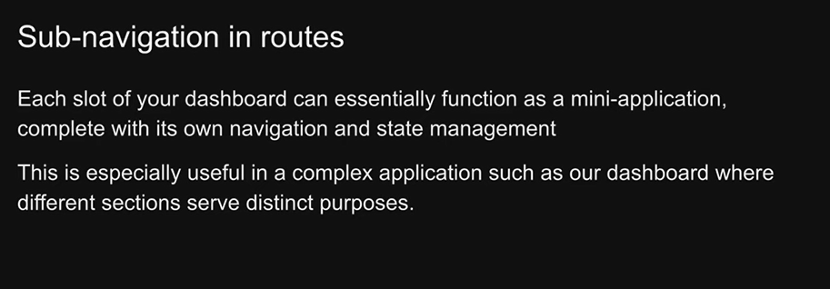
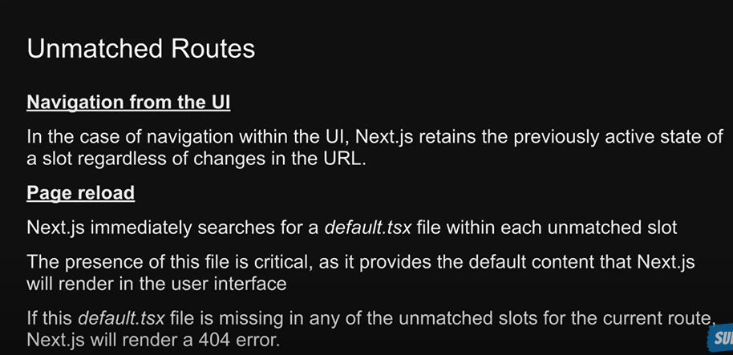

# nextjs_prac
RSC : React server components introduced by the react in 18 version

- Server components
- Client Components

-Server Compontents

- In nextjs all components are server components by default
- They have the ability to run the task like reading files or fetching data from a database.
- However they don't have the ability to use hooks or handle user interactions

client Components:

- To create to add "use client" at the top of the page
- perform task such that interactions and hooks

Routing:

File system based riuting mechanism
URL paths that user can access in the browser are defined by files and folders in the codebase.

Routing Conventions:

1. All Routes must be place inside the app folder
2. Every file that corresponds to a route must be names page.js or page.tsx
3. Every folder corresponds to a path segment in the browser URL

Dynamic Routes

Catch All Segments

Private Folders:---

A private folder indicates that it is a private implementation detail and should not be considered by the routing system

The folder and all its subordinate are excluded from routing

Prefix the folder name with an underscore

Benefits :
- For seperating the UI logic from the routing logic
- For xonsistently organizing internal files across a project
- For sorting and grouping files in the code editors
- Avoiding potential naming conflicts with future Next.js file conventions

Routes Group:--

Allows us to logically group our routes and project files without affecting the URL path structure

Layout :
A page is UI that is unique to a route
A layout is UI that is shared between multiple pages in the app

How to create Layouts 

1. layout.tsx, layout.js
2. That component should accept a children prop that will be populated withh a child page during rendering

Route Group Layout

Riute Group uses:

To organize your project in a manner that doesn't affect the URL
To selectively apply a layout to certain segments while leaving other unchanged

Configuring Metadata

Export a static metadata object
Export a dynamic generateMetadata function

Metadata Rules:
layout and page files can export metadata
layout : all pages in that layout
page: only for that specific file

Link Component

Navigate Programatically

Templates 
Templates are similar to layout is that they wrap each child layout or page

Parallel Routes 
Parralel routes are an advanced roiting mechanism that allows for the simultaneous rendering of multiple pages with in the same layout

Parallel routes in nextjs are defined using a feature known as slots
Slots help structure out content in a modular fashion

to define a lot we use the '@folder' naming convention

Independent route handling
Sub - Navigation
Granular way 

Default.tsx

The default.tsx file in next.js serves as a fallback to render content when the framework cannot retrieve a slot's active state from the current URL

You have a complete freedom to define the UI for unmatched routes: you cab either mirror the content found in page.tsx or craft ab enirely custom view

INTERCEPTING ROUTES:

Intercepting routes allow you to intercept or stop the default routing behaviour to present an alternative view or component when navigating through the UI, while still preserving the intended route for scenerios like page reloads

This can be useful if you want to show a route while keeping the context of the current page

Route Handlers :-

We can also create custom request handlers for our routes using a feature called route handlers

Unlike page routes, which respond with HTML content, route handlers allow you to create RESTful endpoints, giving you full control over the response.

There is no overhead of having to create and configure seperate server.

Route handlers are also great for making external API routes

Route handlers run server-side ensuring that senstive information like private keys remains secure and never get shipped to the browser

Route Handlers are the equivalent of APi routes in Page Router

Headers IN Route Handlers

HTTP headers represent the metadata associated with an API request and response

Request Handlers

These are sent by the client, such as a web browser, to the server. which helps the server understand and process it correctly

"user-agent":browser
acceptt: text 

Response Headers:

Response Headers:
are sent back from the server to the client. Information about the server and the data being sent in the response.

content-type

Cookie in Route Handlers

Cookie are small pieces of data that a server sends to a user's web browser.
 - Session management
 - Personalization like user preference and themes
 - Tracking the user

 Caching in Route Handlers:

 Route handlers are cached by default when using the GET method with the response object in the Next.js

 - Dynamic mode in Segment Config Option
 - Using the Request object with the GET method
 - Employing dynamic functions like headers() and cookies()
 - using any HTTP mehtod other than GET

 Middleware 

 Middleware in next.js is a powerful feature that offers a robust way to intercept and control the flow of requests and responses wwithin your applications

 authentication, headers 

Middleware allow us to specify paths where it will be active:
- Custom matcher config
- Conditional statements

